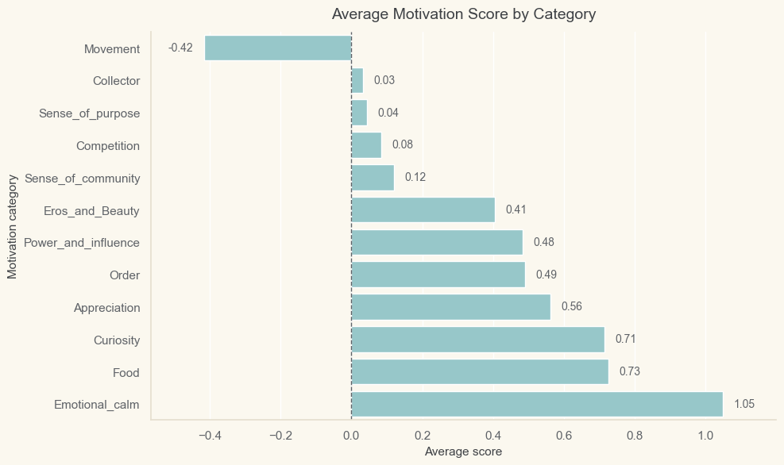
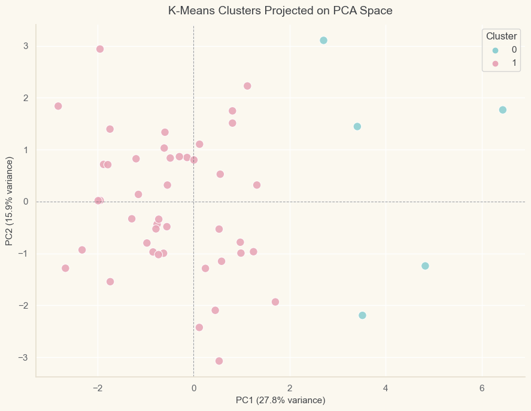
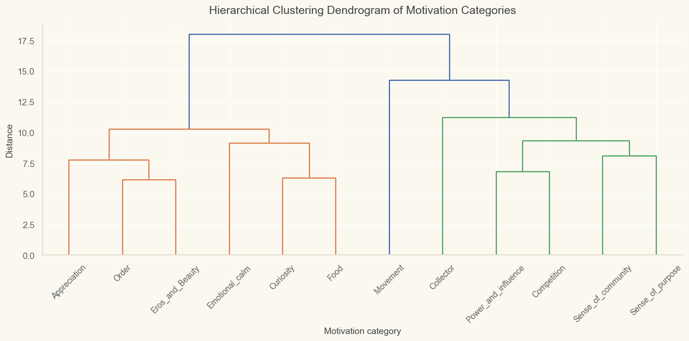

# Motivation-Based Participant Segmentation

Unsupervised learning project for exploring participant motivation profiles and relationships among motivation categories.

The project uses clustering, PCA, and motivation-category analysis to investigate whether hidden structure exists in a small dataset without relying on a target variable.

For a concise non-technical overview, see the [project summary](reports/project-summary.md).

## Visual Highlights

### Motivation categories differ in average intensity



Emotional calm, food, and curiosity have the highest average scores, while movement is the only category with a clearly negative average. This gives the analysis an initial reference point before clustering: some motivations are broadly stronger across participants, but average scores alone do not explain how participants group together.

### Participant clusters show a small unusual profile



The PCA projection shows one broad mainstream group and a much smaller group of participants separated mainly along the first principal component. This supports the interpretation that the participant structure is gradual, with a small lower drive/exploration profile rather than sharply separated psychological types.

### Motivation categories form two response-pattern families



The motivation-category dendrogram separates the 12 categories into two broad families. One family is more social/drive-oriented, while the other is more personal/reward-oriented. Movement belongs to the social/drive-oriented side, but its long branch suggests that it behaves more distinctly than the rest of that family.

## Why This Project Matters

Motivation data is often exploratory by nature. There may be no predefined label that says which participant belongs to which group, but clustering can help reveal patterns that are not obvious from summary statistics alone.

This project focuses on careful interpretation rather than forcing a perfect clustering solution. Each method is used for a specific reason, and the results are compared to understand whether the patterns are stable, gradual, or algorithm-dependent.

## Project Questions

1. Can participants be grouped according to similar motivation profiles?
2. Can motivation categories be grouped according to similar response patterns across participants?

## Dataset

The dataset contains 49 participants and 12 numerical motivation categories:

- Power and influence
- Sense of community
- Curiosity
- Appreciation
- Collector
- Sense of purpose
- Food
- Movement
- Emotional calm
- Order
- Eros and beauty
- Competition

Each participant is identified by `Patient_ID`. The remaining columns contain motivation scores.

## Methods Used

The analysis combines exploratory data analysis, preprocessing, dimensionality reduction, and multiple clustering methods.

### Exploratory Data Analysis

The EDA investigates average motivation levels, score distributions, variability across categories, and correlations between motivation categories.

### Preprocessing

The participant-level motivation matrix is standardized before clustering. This is important because K-Means, hierarchical clustering, DBSCAN, and PCA visualization depend on distance, variance, or feature-scale structure.

For motivation-category clustering, the matrix is transposed so that each motivation category becomes an observation described by participant response patterns.

### Participant Clustering

Three clustering approaches are compared:

- K-Means: used as a baseline centroid-based clustering method.
- Hierarchical clustering: used to inspect participant similarity structure through a dendrogram.
- DBSCAN: used as an exploratory robustness check to detect dense groups and unusual profiles.

### Motivation Category Clustering

Hierarchical clustering is used to group motivation categories according to similar response patterns across participants. PCA is used only for visualization, not for creating the clusters.

## Main Findings

### Participant Profiles

The participant-level analysis suggests that the structure is gradual rather than sharply separated.

K-Means identified a small cluster of 5 participants and a larger mainstream group of 44 participants. Hierarchical clustering also identified a smaller minority group, but defined it more broadly with 11 participants.

DBSCAN did not identify multiple dense clusters. Instead, it found one main dense group and three noise points: `P1`, `P23`, and `P44`.

The strongest participant-level finding is that these three DBSCAN noise points also belong to the small K-Means cluster and the minority hierarchical cluster. This agreement across methods suggests that they represent especially unusual motivation profiles within the dataset.

Overall, the participant structure appears to contain:

- one broad main participant group
- a smaller lower drive/exploration profile
- a few especially unusual participants within that profile

### Motivation Category Families

The motivation-category analysis suggests that the 12 categories can be grouped into two broad response-pattern families.

The first family is a social/drive-oriented group:

- `Power_and_influence`
- `Sense_of_community`
- `Collector`
- `Sense_of_purpose`
- `Movement`
- `Competition`

The second family is a personal/reward-oriented group:

- `Curiosity`
- `Appreciation`
- `Food`
- `Emotional_calm`
- `Order`
- `Eros_and_Beauty`

`Movement` is assigned to the social/drive-oriented family, but it behaves more distinctly than the other categories in that group. This appears both in the dendrogram and in the PCA visualization.

## Important Interpretation

This project does not claim that the clusters are definitive psychological categories. The dataset is small, and unsupervised learning does not provide a single correct answer.

The results should be understood as exploratory patterns supported by consistency across methods, cluster profiling, and visual inspection.

## Repository Structure

```text
.
├── data/
│   └── Motivation_Challenge_Test.xlsx
├── images/
│   ├── average-motivation-score-by-category.png
│   ├── motivation-category-hierarchy.png
│   └── participant-clusters-pca-kmeans.png
├── models/
├── reports/
│   └── project-summary.md
├── Motivation_Challenge_Final.ipynb
├── README.md
├── requirements.txt
└── .gitignore
```

## How to Run

1. Clone the repository or download the project folder.
2. Install the required Python libraries with `pip install -r requirements.txt`.
3. Open `Motivation_Challenge_Final.ipynb` in Jupyter Notebook, JupyterLab, or PyCharm.
4. Run the notebook from top to bottom.

The notebook uses a project-root path setup, so the dataset should remain inside the `data/` folder.

## Tools and Libraries

- Python
- pandas
- numpy
- matplotlib
- seaborn
- scikit-learn
- scipy

## Limitations

The dataset contains only 49 participants, so the results should not be generalized without validation on a larger sample.

Cluster names were assigned after profiling the clusters. They are descriptive labels, not fixed psychological categories.

The analysis is based only on numerical motivation scores. Additional demographic, behavioral, or contextual information could help validate whether the identified profiles are meaningful in practice.

Because this is an unsupervised learning project, there is no target variable to confirm the correct clustering solution. The conclusions are based on consistency across methods, interpretability, and exploratory structure.

## Project Status

Notebook analysis completed. Standalone repository prepared for GitHub publication.


